# DOCKER

## Why do you need docker?


The main use of Docker is to containerize them, ship them and run them whenever and wherever we want.

When we build a software with many components, We have to make sure that the components that are installed on our pc are compatible with the OS that we are using and also there is no conflict with the version of a library (One component might need a particular version of library and other component might need another.). All of this makes developing, building and shipping the application difficult.

This is where Docker comes in.

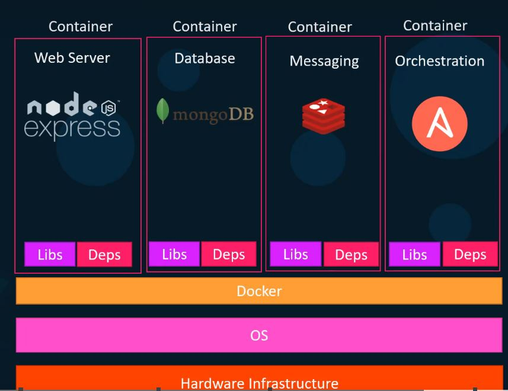

Here each component can run in its own container isolated from dependencies outside. Docker containers are isolated from the host system and other containers. So we won't face os compatibility issues as well.

## Containers
Containers are completely isolated environments. They can have their own services, processes, network interfaces. But they share the same OS Kernel.


OS Kernel acts as a middleware between the software applications and the hardware.

So for Linux based OS, we have the same Linux kernel among Ubuntu, Fedora, Debian etc and It is the software above that makes the difference between these Operating Systems.

As the kernels are same for Ubuntu, Fedora, Mac etc., we can have Fedora environment in ubuntu or Debian enviroment in Fedora etc (As long as the OS Kernels are same).

<b>But Windows and Ubuntu kernels are different and yet we can have ubuntu environment in Windows. How is that possible?</b>

<i>Linux-based Docker containers cannot be run natively on Windows because the operating systems have different kernels. Docker containers rely on features provided by the underlying kernel, and Linux and Windows have different kernel architectures and APIs.

To run Linux-based Docker containers on Windows, you need to use a virtualization solution, such as Docker Desktop for Windows, which includes a lightweight Linux VM that runs the Docker daemon. This VM provides a Linux environment for running Docker containers, while the Windows host system manages the virtualization.</i>


<b>Clarify this: Linux Based Docker cannot be run on windows because the OS Kernels are different. </b>

## Virtual Machines vs Containers

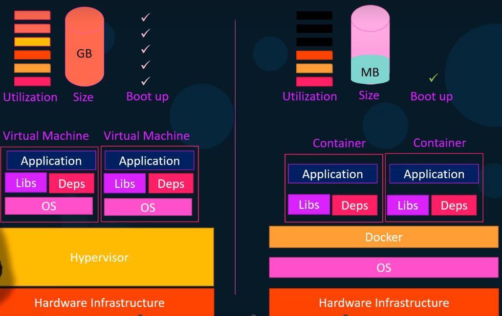

An hypervisor, also known as a virtual machine monitor (VMM), is a type of software that allows multiple operating systems to run on a single physical computer.

The hypervisor sits between the hardware of the computer and the operating systems that are running on it, and it provides a layer of abstraction that allows the operating systems to think they are running directly on the physical hardware, when in fact they are running on a virtual machine.

## DockerHub
DockerHub is a public repository of images of the applications. For eg., It contains images of ubuntu, mongo, node etc. 

## Images vs Containers
Image is the template of the application and Containers are basically runnable instances of the images.

<i>An image is a read-only template that contains everything needed to run an application, including the code, libraries, dependencies, and configuration files. An image is essentially a snapshot of a specific version of an application and its dependencies, and it can be used to create multiple container instances. </i>

## Docker commands

### Version Command

The version command gives the version details of docker client and docker server. The Docker client is a tool that sends commands to the Docker server, and the Docker server is the component that actually executes those commands and manages the container lifecycle. Together, the client and server enable users to interact with Docker and create, run, and manage containerized applications.
```
docker version
```

### Run Command

To <b>start a container</b>, use the below command
```
docker run <image>
```

For eg.,
The below command pulls the whalesay image from dockerhub (If the image does not exist locally) and executes the image with the given parameters.
```
docker run docker/whalesay cowsay Hello-Docker!
```
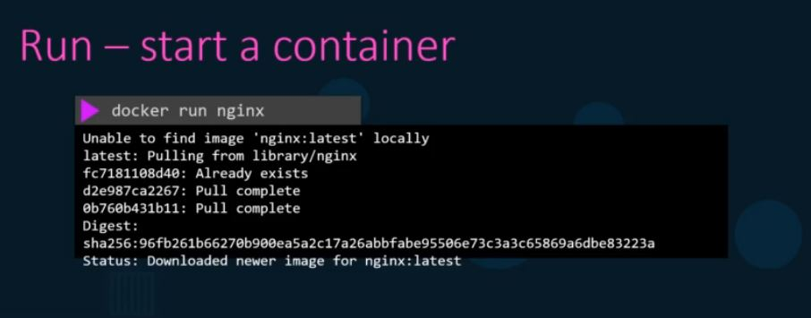

### ps command

This command is used to list all the active (running) containers.
```
docker ps
```

The below command is used to list all the containers whether they are running or not.

```
docker ps -a
```


<b>Here the container id and names are unique. </b>

### stop command

The below command is used to stop a running container using the container id or the container name.

```
docker stop <container-name | container-id>
```

Eg.,
```
docker stop silly_samet
```

Now that the container is stopped, we won't see the container in the docker ps command but we will see the container in docker ps -a command because this command shows the list of active and inactive containers.

### rm command
When a container is stopped, the container files still occupy space in disk. To start the stopped container, we can simply use the below command
```
docker start <container_name | container_id>
```

To remove a container completely, so that It does not occupy space in the disk, use the below command
```
docker rm <container_name | container_id>
```

### images command
This command is used to list all the images.
```
docker images
```
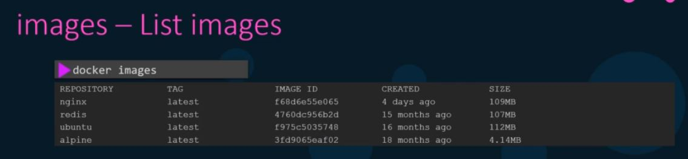

### rmi command

This command is used to remove an image
```
docker rmi <respository | image_id>
```
For eg.,
```
docker rmi nginx
```

### pull command

This command is used to pull an image. The docker run command pulls an image and starts a container. The pull command is only used to download an image.

```
docker pull <image_name>
```

For eg.,
```
docker pull nginx
```

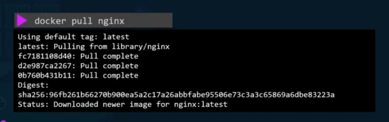

Note:
To find the os version of an image, use the below command

```
docker run <image-name> cat /etc/*release*
```

# Important
When we run an image, For eg.,
```
docker run ubuntu
```
We will see that the container stops (see this in docker ps -a command). 

<b><i>Remember: The container only lives if there is a process running inside the container. In the ubuntu container, no processes were running and that is why the container stopped.
</i></b>

### Docker exec command
Exec command is used to execute a command on a running container.

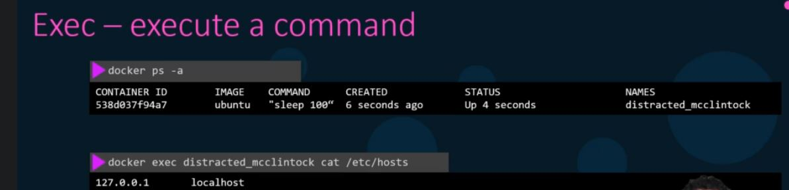

In the above image, we are printing the output of hosts file in the container.

## Docker Run Command in detail

The below command is used to run a specific version of docker image
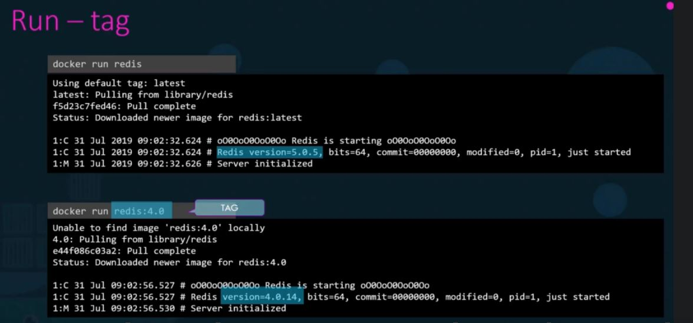

NOTE: 
<i><b>When we run an image, using just the docker run command, the containers output is directed to the standard output of the terminal while the container's input is not (See the below image for the reference). We have to use the -it tag (interactive terminal) to send inputs to the container </b></i>

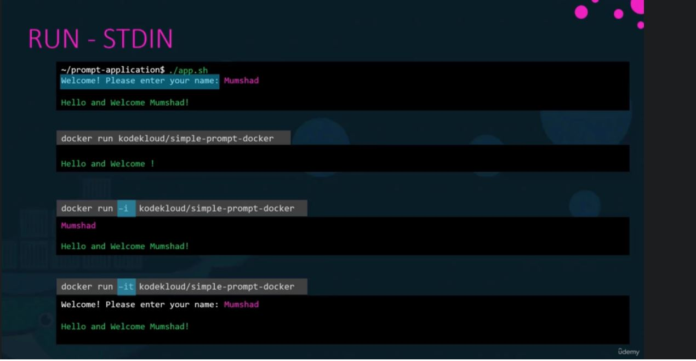

### Port Mapping
Suppose we run a web server in a docker container and the container runs it in port 5000 for example. Now, we cannot access the web server using <i>localhost:5000</i>, because the docker container has an IP of its own. To get the IP, use docker inspect command. But even if we use the ip of the docker, then we can access the web server in the docker host only (The pc which is running the docker container). 

So if we want to map the port of our pc to the port of the docker container, then we have to use the command below
```
docker run -p 8000:8000 <image-name>
```

What the above command does is that it maps localhost:8000 to docker-ip:8000 and we can now access the web server in the localhost.


### Volume Mapping
Suppose we run a container of mysql. All the data of mysql are stored in /var/lib/mysql inside the container (Remember this file system is isolated). Now what happens if the container is deleted, then the data is also gone. In this case, we can do volume mapping. 
<b><i>Meaning, We can map a folder outside the container to a folder inside the container so that all the data of mysql is stored in that external folder and if the container is deleted, then we dont have to worry as we stored the data outside of the container</i></b>

```
docker run -v /opt/datadir:/var/lib/mysql mysql
```

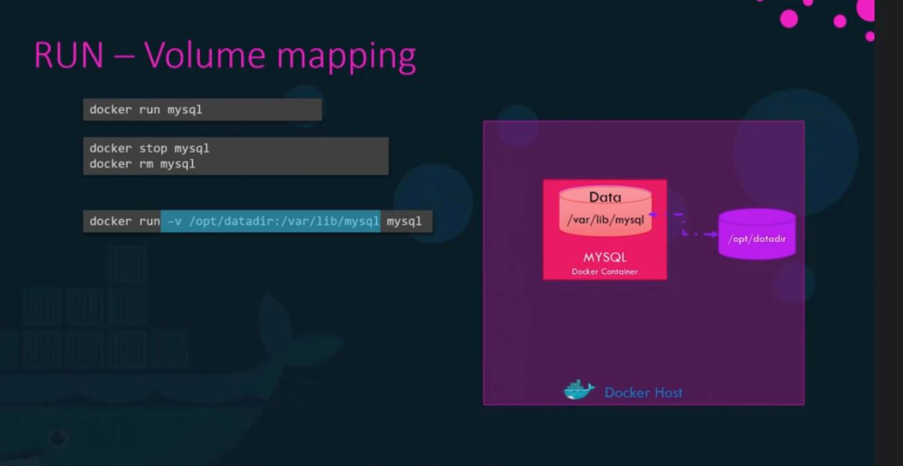

### Inspect Command
This command is used to get more details of a container.
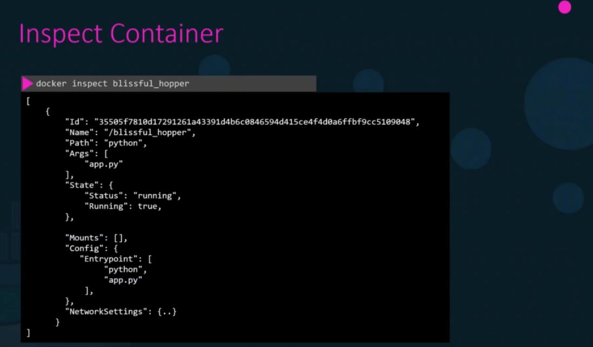

### Container Logs
This command is used to get logs of a container.
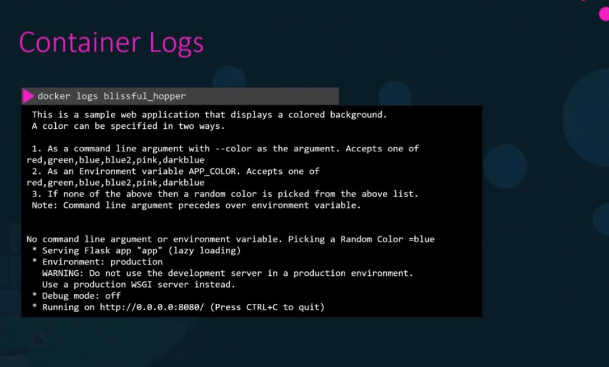

## Docker images
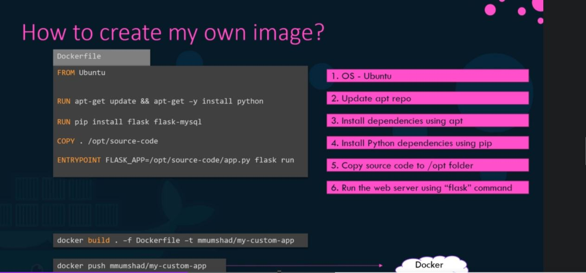
The above image shows the Dockerfile to build an image of the flask app

The docker build command takes in the files (In this case it takes the current directory), the dockerfile name using -f tag and the tag name of the image using -t

Then to push the image in the dockerhub, we use the docker push command.

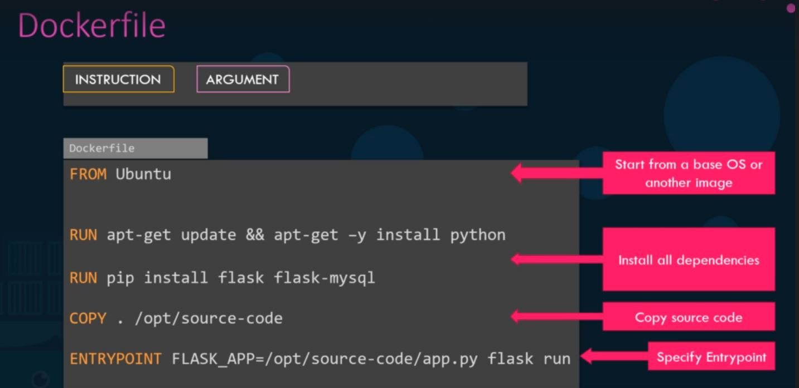

Layered Architecture is followed when building an image as shown below

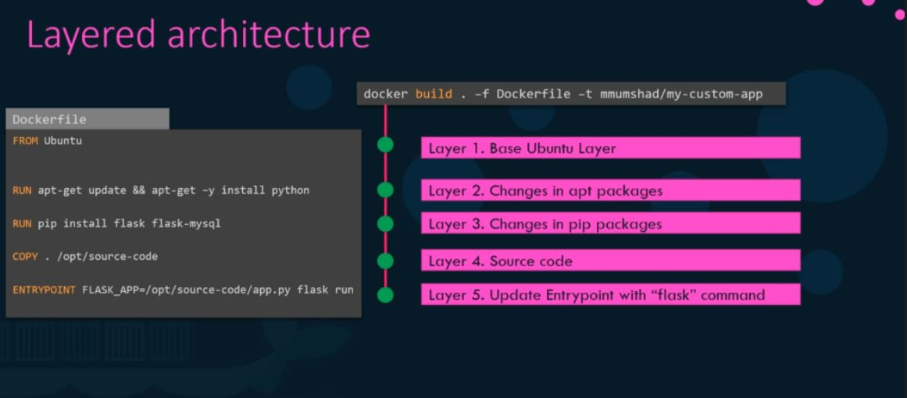

We can also see the information on layers using the below command

```
docker history <image-name>
```

All the layers are cached. That means let's say we are building an image and from the above docker file, let's say ```RUN pop install flask flask-mysql``` fails for some reason. Now when we try to build the image next time, the image building process would start from this command only rather than building the image from start.

### Docker environment variables

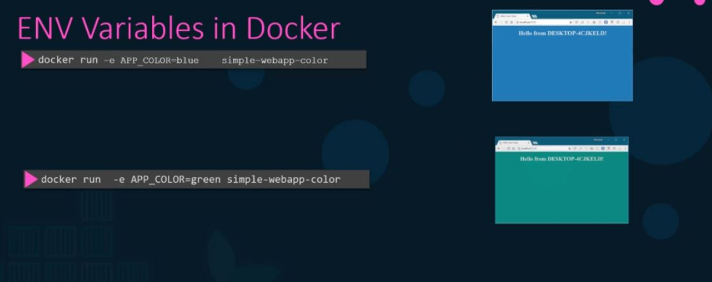

### CMD vs EntryPoint in Dockerfile

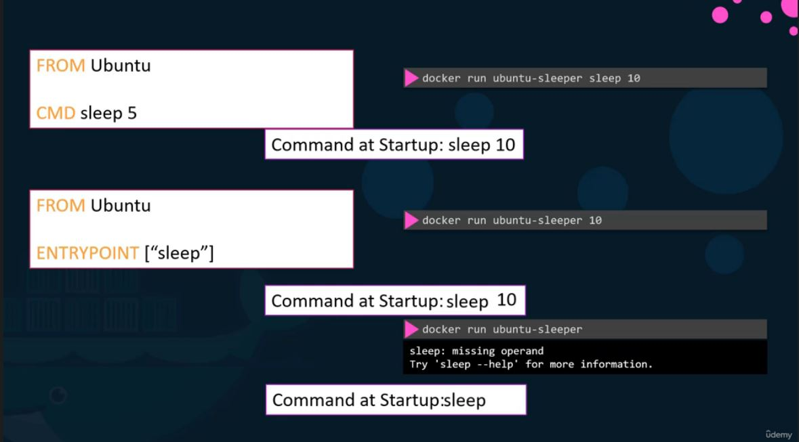

In CMD, the command gets replaced if we supply a command through the docker run command, but in entry point, the command gets appended.

NOTE that in the above image, we can write CMD as CMD ["sleep", "5"], same with the entry point, we can write as a whole string or array.

But what in the above image, if we just run the docker run ubuntu-sleeper with no values to be appended to the entry point, we get an error. So how to specify a default value of sleep? (Refer below image)

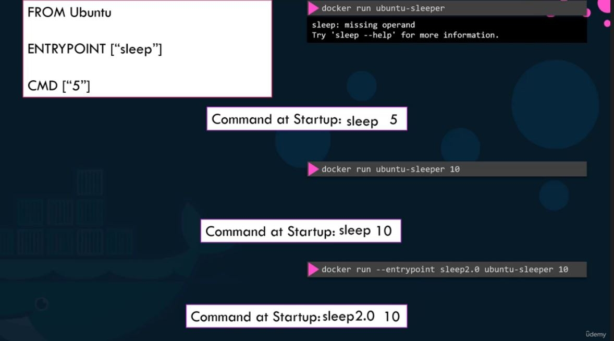

Note that if we see the dockerfile for the ubuntu image, they have CMD ["bash"]. So what happens when we run ```docker run ubuntu``` is that the container is not able to find a terminal to run the bash command and so it exits immediately. But when we run ```docker run -it ubuntu```, then we are attaching an interactive terminal and it would run the bash command


## Docker compose

Read about networking in docker
